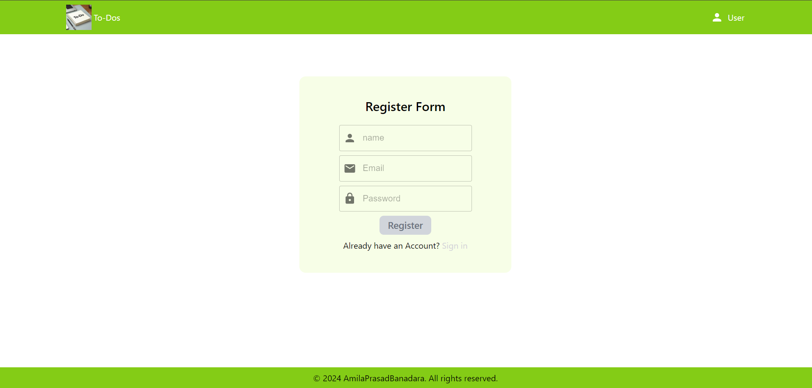
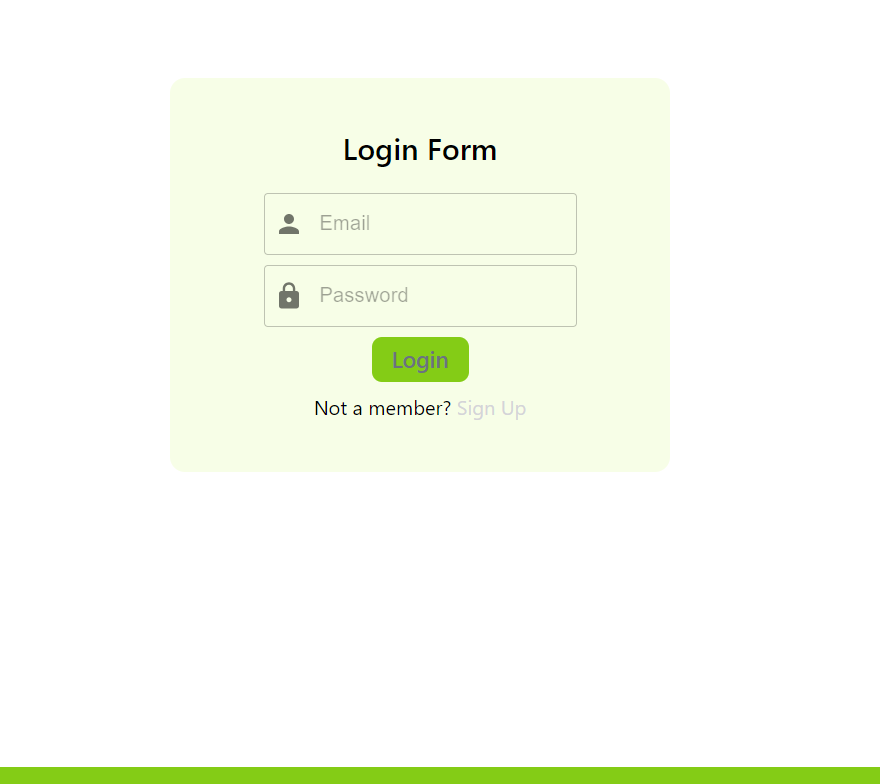
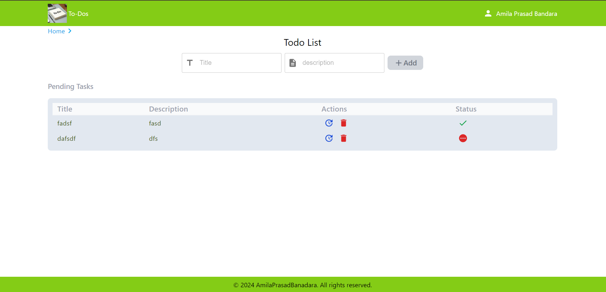
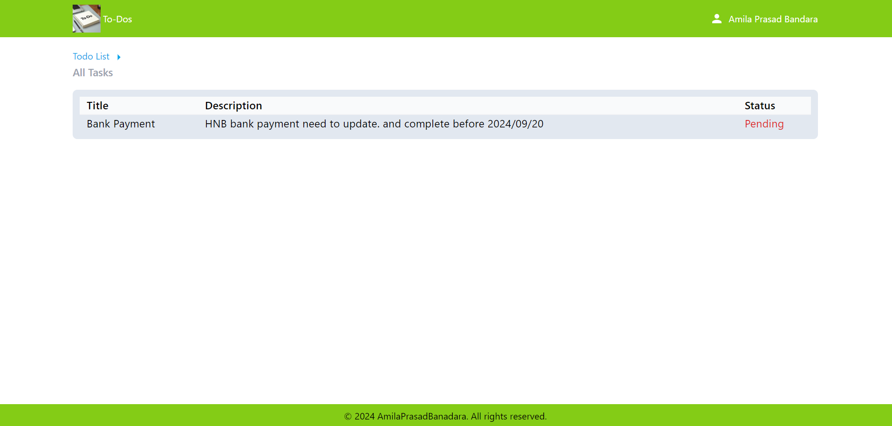

# Todo App 
This is a simple yet powerful To-Do application that allows users to manage their tasks efficiently. The app includes user authentication, enabling users to create their own accounts, log in, and securely manage their personal to-do lists.
* **User Authentication:** Secure login and registration system using Context Api and local storage.
* **Task Management:** Users can create, edit, delete, and mark tasks as completed.
* **Persistent Data:** All tasks are stored in the local storage, ensuring that user data is saved even after logging   out or closing the app.
* **Responsive Design:** The app is mobile-friendly and can be accessed on any device.
* **Real-time Updates:** Provides real-time updates when tasks are added or modified, ensuring a smooth user experience.

## Installation 
* Download the project from the repository
* Route to the project folder and run `npm install` command
* To run the application run `npm run dev` command

## Registration and Authentication:

* **Registration:** Users must first register to access the application. Unregistered users cannot navigate to other pages through the app's routes.

* **Login:** After registration, users are redirected to the login page. To access the app, users must log in with their username and password.

## To-Do Management:

* Upon successful login, users are redirected to the To-Do page. Here, they can:
* **Create:** Add new tasks.
* **Read:** View their list of tasks.
* **Update:** Edit existing tasks.
* **Delete:** Remove tasks from their list.

## Navigation:

* __Home Page:__ Users can navigate to the Home page via a link located in the top left corner of the To-Do page.

* __Task Management:__ On the Home page, users can view all their tasks but cannot make changes. To add or edit tasks, users must navigate back to the To-Do page using the link provided.

## Technologies Used:
* __Frontend:__ React with vite
* __Database:__  Local storage 
* __Authentication:__  Context Api to manage user authentication
* __Styling:__ CSS / Tailwind MUI / MUI icons